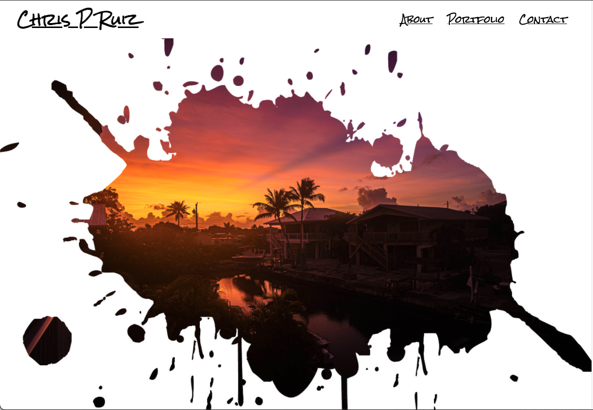

## Portfolio
This is my portfolio which showcases my skill in HTML and CSS code with a "simple" yet "complex" design.

## Built With 
* HTML
* CSS
 
    1. I've added working navigation links in both the header and footer that jumps to the corresponding sections of the page.
    2. The background "splash" is a masking technique that stacks two images on top of eachother. 
    3. My bio section includes a large "block-type" letter like you'd find in a book.
    4. My links have a hover feature which greys the text.
    5. The page is formatted for use on any desktop, tablet, or phone.
 
    
 
    
    [URL of deployment](https://chrispruiz.github.io/Portfolio/)
    
    [GitHub Repository Link](https://github.com/Chrispruiz/Portfolio.git)